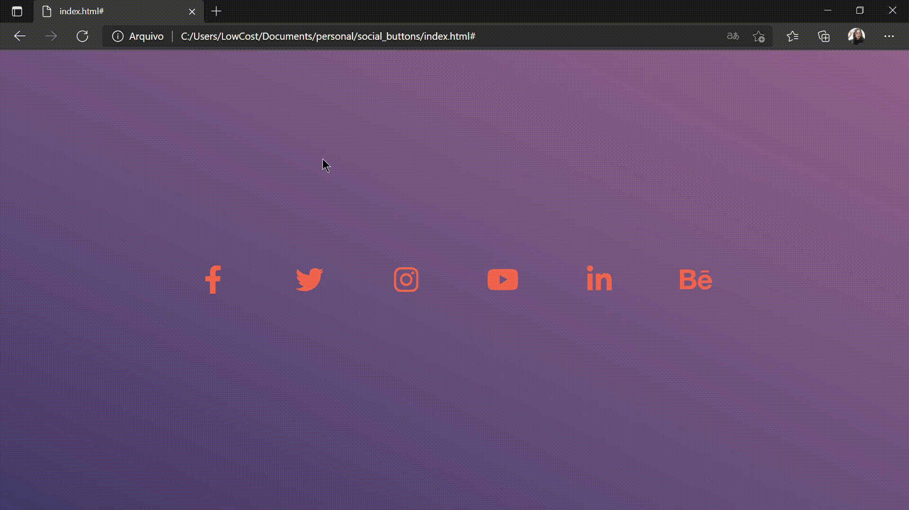

<h1>Social Buttons Design</h1>

 <a href="#objetivo">Objetivo</a> • 
 <a href="#tecnologias">Tecnologias</a> • 
 <a href="#autora">Autora</a>

<h2 id="objetivo">Objetivo:</h2>

Um projeto criado com o objetivo de estudar um pouco mais sobre animações em CSS e Design de páginas no geral, também planejo aplicar a um protifólio futuro.

<h2 id="tecnologias">Tecnologias:</h2>

Projeto feito com CSS3 e HTML5, fora utilizado também uma fonte externa para conseguir os icones (<a href="https://fontawesome.com/">Font Awesome</a>).

 
<h2 id="autora">Autora:</h2>

Camila C. R. Santos

  

